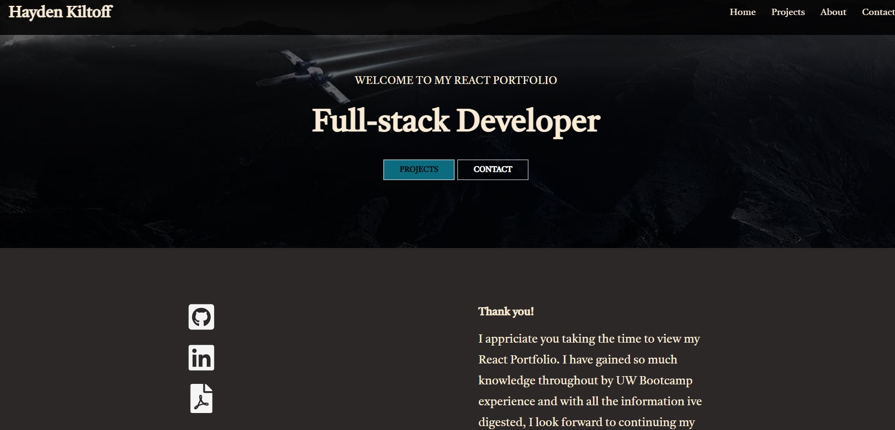
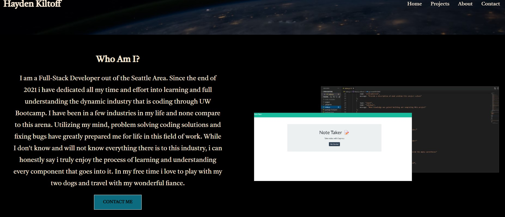
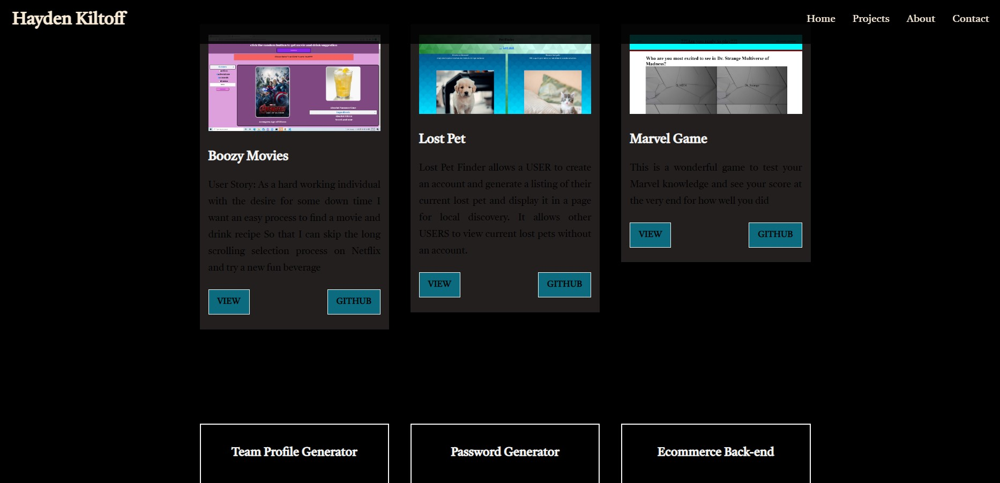
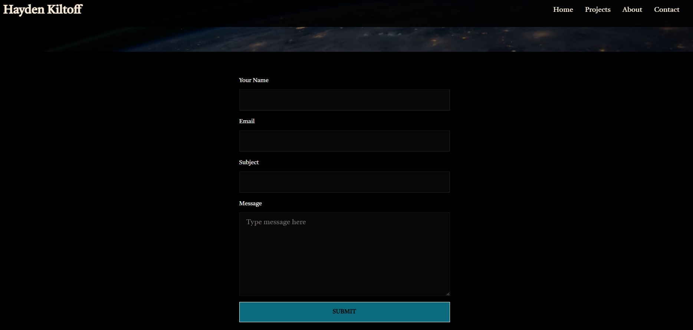

 # Hayden's Portfolio


## License(s)
[](https://opensource.org/licenses/MIT)


## table of contents
1. [Description](#description)
2. [Installation](#installation)
3. [Usage](#usage)
4. [Credits](#credits)
5. [License](#license)
6. [Questions](#questions)
        
        
        
## Description
This is a portfolio of Hayden Kiltoff. Lists specific projects completed and a contact form followed by an about page

The motivation to build this is to allow a user to explore my current demostations of ability when it comes to my portfolio

This allows to the user to see pre-defined projects and contact me through seperate links

The knowledge gained building this is creating a React profile
        
        
## Installation
The tools installed to build this project was ```react-bootstrap  react-dom  react-healpers  react-icons  react-router-dom```

Just follow the deployed page of my portfolio!
        
        
## Usage
You can nagivate through my portfolio from the main header bar to specific pages. There are buttons placed around the site to nagivate to other pages. When in MOBILE view, there is a icon in the corner to allow the USER to nagivate to other pages.





        
## Credits
Hayden Kiltoff

No third party assets were used
        
        

## Questions
You can access my github repository from here https://github.com/hayden1773
        
You may also forward an email for more information or questions to hayden060@gmail.com
        
## Features
Hamburger menu when in mobile view 

Contact form
        
        
## Tests 
